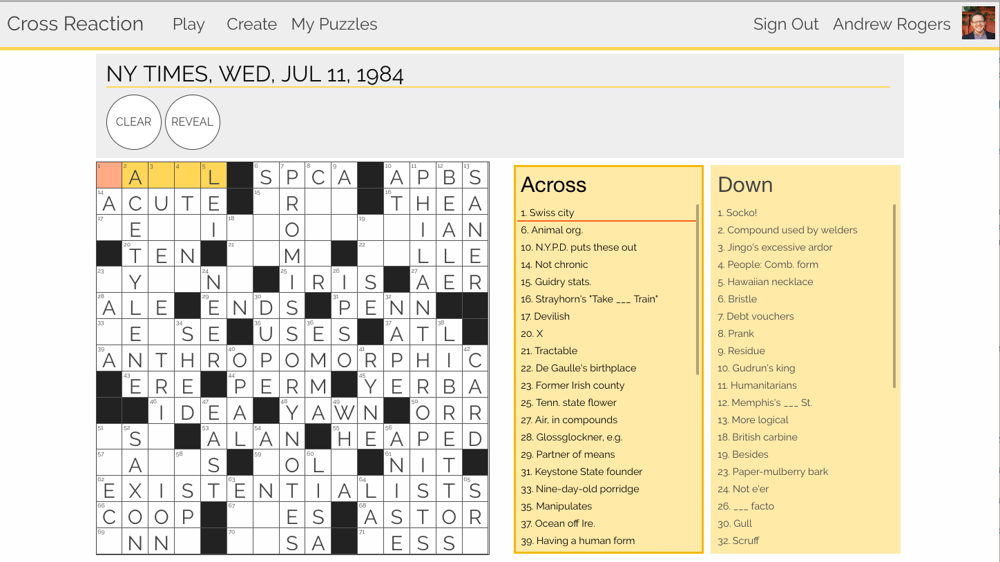

# Cross Reaction
Cross Reaction is app for solving and building crossword puzzles. CR is built with Ruby on Rails, and utilizes a React front-end for an intuitive solving and constructing interface.

[See this app on Heroku! ✏️](https://cross-reaction.herokuapp.com)

#### Features:
- Solve crosswords in a simple interface. Use the keyboard to navigate quickly!
- Create custom puzzles with our editor. If you're feeling stuck, use the match feature to find words fitting a pattern.
- Publish puzzles and share them with your friends
- Signed-in users have their solutions and draft puzzles saved automatically



## Running locally
Run the following to get the app and install dependencies
```
$ git clone https://github.com/andrewprogers/crossword-react-on-rails.git <your-dir-name>
$ cd <your-dir-name>
$ bundle install
$ yarn install
```

Setup the database. The seed file is optional and will include a few puzzles
```
$ rake db:create
$ rake db:migrate
$ rake db:seed
```

In order to sign-in, you will need to set up user authentication with google oauth2.
Create a `.env` file in the root directory with the following keys: `GOOGLE_OAUTH_CLIENT_ID`, `GOOGLE_OAUTH_CLIENT_SECRET`

To run the app, run the following in 2 separate terminal windows
```
$ ./bin/webpack-dev-server
$ rails s
```
...then visit `localhost:3000` in your browser!

## Where are the tests?
The app includes 2 separate test suites:
- Ruby tests are located in `/spec`. Run with:`rspec`
- Javascript tests can be found in `/app/javascript/react/test`. Run with `karma start`
  - For more info on setting up a react-on-rails app with this test suite, [see here](https://gist.github.com/andrewprogers/65f0228c262fbe8e1efe767527540aec)

## Deployment details
This project can be deployed to Heroku without any additional buildpacks / customization (thanks to the use of the webpacker gem).
Remember to set the environment variables in heroku in order to enable sign-in

## Thanks
- I'd like to thank [datamuse](http://www.datamuse.com/api/) for offering their API without registration, it is excellent and simple to use!
- This project was created as a breakable toy during my time at [Launch Academy](https://www.launchacademy.com/). I owe a huge debt everyone there.
